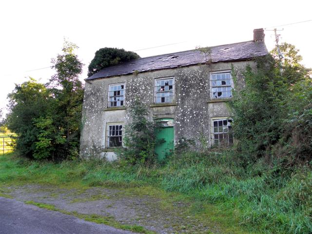

# Ireland_Housing_Prices
Analysis of Irish Housing Prices

<figure>
    
    <figcaption>Geograph - https://www.geograph.ie/photo/3116632</figcaption>
</figure>

## Introduction
This project will use data from The Residential Property Price Register (RPPR) to create
various Machine Learning models to predict property prices in Ireland, then compare the performances
of the models. 

## Requirements
Requirements can be installed using [requirements.txt](https://github.com/21chubaka/Ireland_Housing_Prices/blob/main/requirements.txt).
- Pandas
- Numpy
- Matplotlib
- Seaborn
- Sklearn 

## Data
Property Services Regulatory Authority (PSRA) - The Residential Property Price Register (RPPR) for 2010-2022 
Features: 
- Date of Sale (dd/mm/yyyy):    object
- Address:                      object
- Postal Code:                  object
- County:                       object
- Price (€):                    object
- Not Full Market Price:        object
- VAT Exclusive:                object
- Description of Property:      object
- Property Size Description:    object 

Central Statistics Office provided by the government of Ireland - Income Per Person and Income Indices by County by Year for 2010-2022 
Features: 
- Year:                                  int64
- County:                              string
- Income_Indices:                      float64
- Income_Per_Person_euro:              float64

## Data Cleaning
Intial data exploration was carried out to better understand the RPPR data and identify any data cleaning that needed to be carried out before
modeling. 
### Initial Descriptive Statistics on Continuous Features
<figure>
    
</figure>

### Initial Descriptive Statistics on Categorical Features
<figure>
    
</figure>

Some integrity checks on the dataset were:
- Check for Null Values by Column
- Check for Negative Price Values
- Check for Future Dates
- Check for Month Values Greater than 12 or Less than 1
- Check for Day Values Greater than 31 or Less than 1
- Check for Year Values Older than 2010
- Check for 'Second-hand Dwellings' with 'Yes' VAT Exclusive
- Check for Outliers by Column
- Etc.

### 'Price (€)' feature
The 'Price (€)' feature contained outliers that were signficantly skewing the data, especially upper bound outliers.  The impact of the outliers
can be observed from the boxplot below.
<figure>
    
</figure>

### 'Postal Code' feature
The 'Postal Code' feature had 8,086 rows with NULL values and some with missing values.  This feature also had some Dublin Postal Codes labeled as
'Baile Atha Cliath', which is Dublin in Irish.

### 'Description of Property' feature
The 'Description of Property' feature had some labels in Irish.

### 'Property Size Description' feature
The 'Property Size Description' feature had 8,984 rows with NULL values.  This feature also had two labels for the same size description of
'greater than 125 sq meters'.

### Data Cleaning Plan
<figure>
    
</figure>
The above image layouts out the data issues identified with the RPPR dataset and the handling strategies employed to clean the dataset.
For some of the issues it was decided to leave them as is, due to the small impact or the goal of keeping data intact. For example, 
after researching the lower bound outliers of the property prices, it was found that those prices and properties were normal (non-developer) 
properties that an individual would purchase. 
As an Irish Language speaker and supporter it pained me, but for the purposes of this project any Irish labels were translated for the continuity of data. 
It should be noted, that in addition to the data cleaning plan, there were some initial changes to feature names, exculsions of symbols in the price feature, and updates to data types to facilitate better data transformations and analysis.

### Income by County Dataset - Central Statistics Office
The final step of data cleaning was combining the RPPR and Income by County datasets.  This was completed by using a left join on 'Year' and 
'County'.

## Exploratory Analysis - RPPR & Income Data
### Target Feature - Price
<figure>
    
</figure>

### Continuous Features
#### Descriptive Statistics on Continuous Features
<figure>
    
</figure>

#### Correlation Statistics on Continuous Features
<figure>
    
</figure>

#### Correlation Matrix on Continuous Features
<figure>
    
</figure>

Some observations from the matrix:
- 'Income_Indices' & 'Income_Per_Person_euro' positively correlated to price.
- 'Income_Indices' are based off of 'Income_Per_Person_euro' and 'Income_Per_Person_euro' is better correlated, so I will focus on 'Income_Per_Person_euro' to start.

#### Income Per Person vs. Price
<figure>
    
</figure>

#### Year vs. Price
<figure>
    
</figure>

#### Continuous Feature Conclusions
<b>Year</b>: 
After doing some analysis, I have decided to include Year as a feature to start. There was a correlation to Price (albeit on the lower end), but it did offer information on how price changed over time (down 2011 and up after 2013). The recession may have negatively affect the correlation number. 

<b>Income Per Person</b>: 
This is an easy feature to choose to include in my models. It was the stronest correlated feature.
Also as mentioned above, while Income Indices is another well correlated feature I will not include it at this time because it is value that is based off of Income per Person. 

### Categorical Features
#### Descriptive Statistics on Categorical Features
<figure>
    
</figure>

Some observations:
- 'Postal_Code' has a high amount of unknown values due to Dublin being the only county that tends to use postal code in that manner.
- 'County' having 26 makes sense due to the 26 counties in the Republic of Ireland.
- 'Property_Size_Description' has an extremely high amount of unknown values and will most likely not be included in the models at this time.

#### Postal Code vs. Price
<figure>
    
</figure>

First, it does show Dublin tends to use postal codes. Also, it does show the price differences with a high level of variation by Dublin postal code. 
From the box plot of postal code vs price, I can dig deeper into Dublin alone, and its specified areas. The highest median prices are Dublin 14, 4, 6, 6w, and 16 – all between 400,000 to 600,000 euro. I noted that these are all even numbered postal codes and therefore are South of the River Liffey. Dublin 6 has the widest interquartile range. The lowest median price was Dublin 10, followed closely by Dublin 11 and Dublin 22. The specific area within Dublin does appear to play an important factor in price.

#### County vs. Price
<figure>
    
</figure>

From the box plot of county vs price, I can easily tell Dublin, the Wicklow, then Kildare, then Meath have the highest median prices – all about 200,000 Euro. Dublin and Wicklow counties have the widest spread and therefore variation as well, both for the interquartile range as well as whiskers. There are several counties where the 75th percentile does not even reach 200,000, such as Carlow, Cavan, Donegal, Laois, Leitrim, Longford, Mayo, Monaghan, Offaly, Roscommon, Sligo, and Tipperary. Leitrim, Longford, and Mayo have the lowest median prices. Leitrim also has the narrowest interquartile range as well as whiskers. It could be useful to explore single counties more, such as Dublin by its postal codes, as well as numerical data specific to each county, such as population size or income levels. 
I find this quite informative of the price variations by county, making it a decent feature to include in the models.

#### Categorical Feature Conclusions
<b>Postal Code</b>: 
I am going to include Postal Code because it is a strong representive of Dublin, which is the most frequent county in the data. That being said, in future analysis/models I want to seperate the data as a Dublin dataset and then the rest of Ireland dataset.

<b>County</b>: 
I am going to include County because it is the most complete feature. The county is captured for every sale. Moreover, County also holds spacial/geographical information accross Ireland.

## Models
For this project, the goal was to compare the performances of predicting house prices of Multiple Linear Regression, Decision Tree, and Random Forest models. 
The cleaned dataset of RPPR/Income was used and the Postal Code and County features were categorically encoded, as they showed promised from the exploratory analysis.  Then the dataset was randomly shuffled and split using the 70/30 train/test split.  The shuffled complete dataset will be used for 5-fold Cross-Validation.

### Features
The features used for the models:
- Year
- Income Per Person
- Postal Code (categorically encoded)
- County (categorically encoded)

## Performance

### Metrics
The performance of the models will be reviewed on:
- Training dataset
- Test dataset
- Complete shuffled dataset

#### The Mean Absolute Error (MAE)
The error of each row is computed, then absolute value taken, and finally averaged across all rows. 

#### The Mean Squared Error (MSE)
The error of each row is computed, then squared value taken, and finally averaged across all rows. 

#### The Root Mean Squared Error (RMSE)
This error is the difference between the actual price and predicted per the model.  This is calculated for each row and then squared.  In the end, the squared error is then averaged, and finally square root is taken.  This is interpreted in the units of the variable being predicted, in this case Property Price.  The lower the RMSE, the better the model. 

#### The R-squared Score (R2)
This is typically in the range of 0 to 1 and is calculated by the sum of all squared errors, divided by the total sum of squares (predictions), subtracted from 1.  R-squared is not dependent on original units (property price), and explains how much better the model is over predicting simply the average of the past prices. 

#### 5-fold Cross-Validation
Used to gauge the ablity of a model to predict on new data.  The dataset is split into k number of folds (5 in this project) and its performance is tested on each fold.  Then the scores are averaged to achieve its cross-validated score.

### Multiple Linear Regression
<table>
    <tr>
        <th>Metric</th>
        <th>Training</th>
        <th>Test</th>
        <th>5-Fold Cross-Validation</th>
    </tr>
    <tr>
        <td>MAE</td>
        <td>112672.37</td>
        <td>115194.74</td>
        <td>113429.41</td>
    </tr>
    <tr>
        <td>MSE</td>
        <td>27799942517.62</td>
        <td>30464257708.54</td>
        <td>28599488564.33</td>
    </tr>
    <tr>
        <td>RMSE</td>
        <td>166733.15</td>
        <td>174540.13</td>
        <td>169041.30</td>
    </tr>
    <tr>
        <td>R2</td>
        <td>0.2690</td>
        <td>0.2522</td>
        <td>0.2630</td>
    </tr>
</table>

#### Training
Based on the MAE, this model is off by 112,672 euro on average. Considering the majority of properties were less than 200,000 euro this is a large proportion to be off by. The RMSE is even higher due to it punishing higher outliers. 
Given those metrics, the low R-squared score of .2690 makes sense. There is ample room to improve! 

#### Test
There is a marginal decrease in R-squared (.2522) and an increase in RMSE (174,540 euro), while running it on the test data. 

#### 5-Fold Cross-Validation
The evaluation metrics were quite similiar accross Train, Test, and Cross. It was expected that Linear Regression would not perform well, given that this is not a linear issue. 

### Decision Tree
<table>
    <tr>
        <th>Metric</th>
        <th>Training</th>
        <th>Test</th>
        <th>5-Fold Cross-Validation</th>
    </tr>
    <tr>
        <td>MAE</td>
        <td>103903.89</td>
        <td>108481.67</td>
        <td>108599.59</td>
    </tr>
    <tr>
        <td>MSE</td>
        <td>23786223710.69</td>
        <td>26617011526.23</td>
        <td>26294193842.12</td>
    </tr>
    <tr>
        <td>RMSE</td>
        <td>154227.83</td>
        <td>163147.21</td>
        <td>162108.93</td>
    </tr>
    <tr>
        <td>R2</td>
        <td>0.3745</td>
        <td>0.3466</td>
        <td>0.3218</td>
    </tr>
</table>

#### Training
Based on the MAE, this model is off by 103,903 euro on average, which is a small improvement from the Linear Regression model based on training data. As stated before, considering the majority of properties were less than 200,000 euro this is still a large proportion to be off by. The RMSE showed similiarly small improvement over the Linear Regression model based on training data. The R-squared score of .3745 is an improvement, but there is still room to improve. 

#### Test
The test data performed slightly less as well as the training data. There was a drop in the R-squared from 0.3745 to 0.3466. 

#### 5-Fold Cross-Validation
We can see a slight improvement overall from the past Linear Regression model CV R-squared (0.2630). Moving in the right direction, but needs more improvement. 

### Random Forest
<table>
    <tr>
        <th>Metric</th>
        <th>Training</th>
        <th>Test</th>
        <th>5-Fold Cross-Validation</th>
    </tr>
    <tr>
        <td>MAE</td>
        <td>99622.19</td>
        <td>108954.88</td>
        <td>107692.97</td>
    </tr>
    <tr>
        <td>MSE</td>
        <td>22232938627.59</td>
        <td>27216804263.40</td>
        <td>25932614948.26</td>
    </tr>
    <tr>
        <td>RMSE</td>
        <td>149107.14</td>
        <td>164975.16</td>
        <td>160991.27</td>
    </tr>
    <tr>
        <td>R2</td>
        <td>0.4154</td>
        <td>0.3319</td>
        <td>0.3310</td>
    </tr>
</table>

#### Training

#### Test

#### 5-Fold Cross-Validation

## Conclusion/Findings

## References
- [Derelict House Image: Geograph](https://www.geograph.ie/photo/3116632)